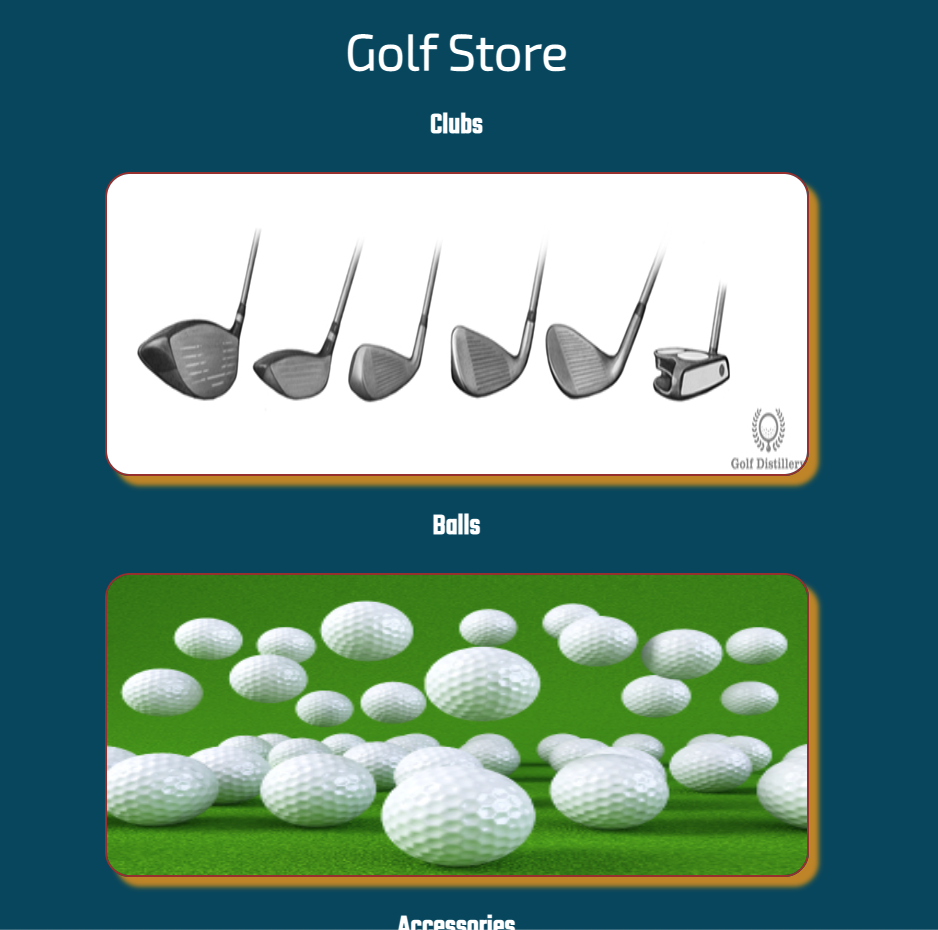
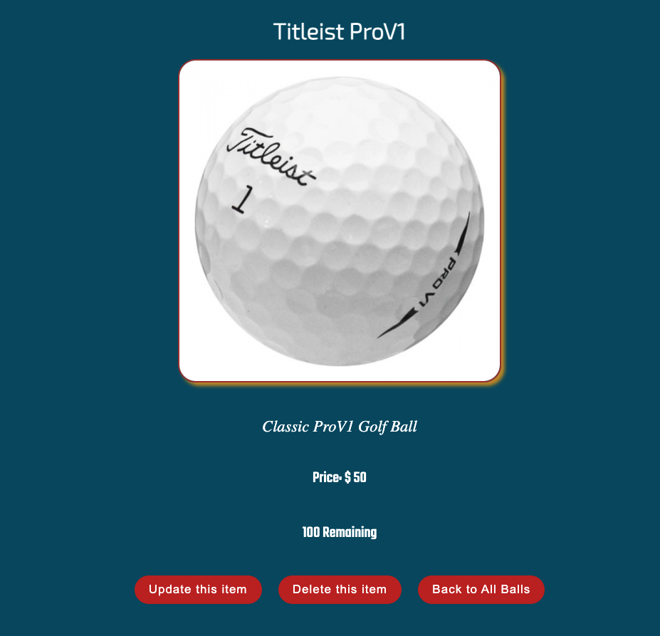
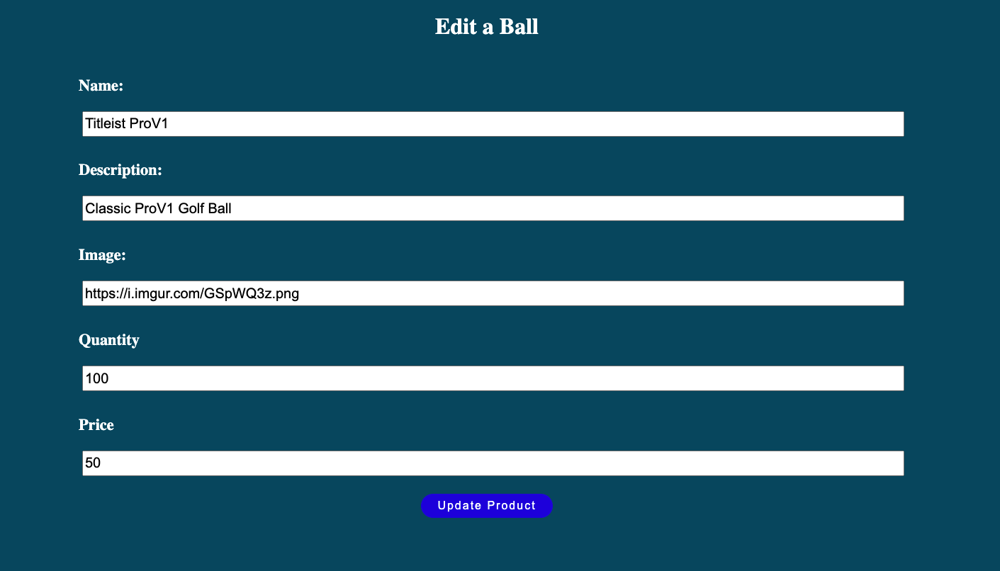
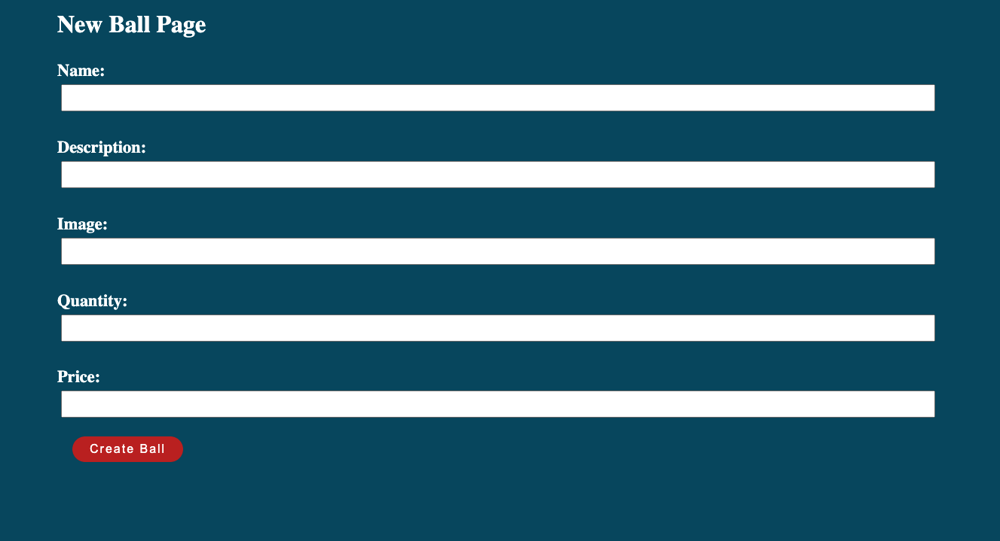

# Golf Store App

---
### Summary

| Project Name  | Golf Store
|----------------|------------------|
| Description   | This is a full CRUD application using express and MongoDB. The user is able to view clubs, balls, accessories, and is also able to update, delete, or create a new item. 
| Developers | Nathan Yi|
| Live Website | https://www.golf-store.herokuapp.com|
| Repo | https://www.github.com/yinathan/golf-store|

---

### Technologies Used
+ HTML5
+ CSS3
+ JavaScript
+ jQuery
+ Google Fonts
+ Express
+ Mongoose
+ MongoDB
+ dotenv, ejs, method-override, morgan, nodemon

---

### Screenshots
Home Page

All Items Page

View Item Page

Edit Item Page

Create Item Page

---

### Getting Started

[Click here](https://www.golf-store.herokuapp.com/store) to access the application. Click on clubs, balls, or accessories to view the full list of items currently stored in the database. If you wish to create a new item, click "Add New Item" button and fill out the form completely. Updating and deleting items can be done on the individual show pages.

### Future Enhancements

I hope to add authentication to only enable the user to edit, delete, or create new items if they are logged into an account. 